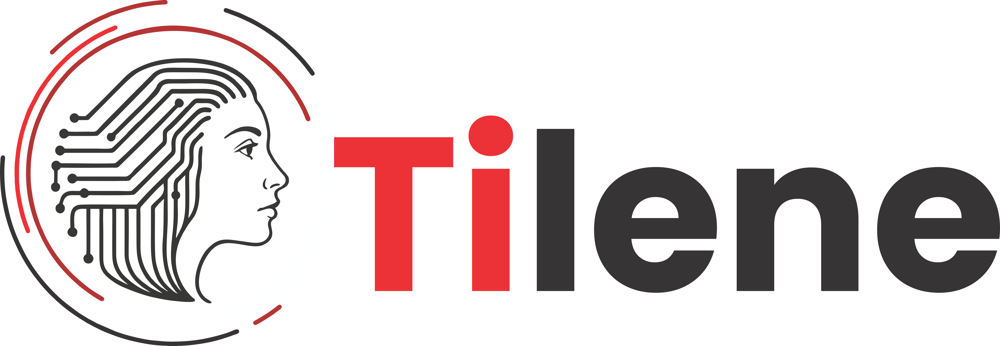

# Home

> _O Tilene é o sistema de IA do MPSP!_

 

O [**_Tilene_**](https://tilene.mpsp.mp.br/) é uma aplicação _web_ que permite que a comunidade do MPSP utilize ferramentas de Inteligência Artificial (IA) para auxiliar no trabalho das promotorias. Representa um avanço significativo na modernização e eficiência das atividades institucionais. A ferramenta é capaz de automatizar tarefas repetitivas e burocráticas, como a elaboração de minutas, pareceres e petições iniciais, permitindo que os membros e servidores concentrem seus esforços em análises jurídicas mais complexas e estratégicas. Com isso, há uma expressiva economia de tempo e recursos, além da padronização e melhoria na qualidade dos documentos produzidos.

Além disso, a plataforma contribui diretamente para o aumento da produtividade e da capacidade de resposta do Ministério Público à sociedade. Por meio de algoritmos avançados, a inteligência artificial é capaz de compreender contextos jurídicos, sugerir trechos relevantes com base em legislações e jurisprudências, e adaptar-se continuamente ao estilo e às necessidades da instituição. Essa inovação fortalece a atuação institucional, tornando-a mais ágil, eficaz e alinhada às demandas contemporâneas da justiça e da cidadania.

 

---

## Desenvolvimento

Desenvolvida originalmente pelo [Tribunal de Contas do Estado de São Paulo](https://www.tce.sp.gov.br/) (TCE-SP), onde é conhecida como _Assistente Natural com Inteligência Artificial_ **_(ANIA)_**, a ferramenta foi concebida para auxiliar na geração de textos técnicos com base em modelos e dados institucionais. Sua arquitetura inteligente permite interpretar comandos em linguagem natural e produzir conteúdos alinhados com as boas práticas jurídicas e administrativas.

A disponibilização do código fonte ao MPSP se deu por meio de um acordo de cooperação técnica firmado em 12.12.2024. A partir desse acordo, o Ministério Público passou a utilizar a aplicação, promovendo uma série de customizações específicas para adequá-la às necessidades, rotinas e particularidades da atuação ministerial. Abaixo é apresentado o Termo de Convênio.

{ type=application/pdf style="min-height:25vh;width:100%" }

 

A [_Subprocuradoria-Geral de Justiça de Estratégia e Inovação_](https://www.mpsp.mp.br/subprocuradoria-estrategia-inovacao) e _Centro de Tecnologia da Informação e Comunicação_ foram responsáveis por ajustes e implantação do Tilene do MPSP.

 

---

## Tilene

O nome da aplicação visa homenagear a Dra. [Tilene Almeida de Morais](https://www.youtube.com/watch?v=4d7L6O6ySwU).

Entrou no Ministério Público de São Paulo em 1967, sendo a sexta mulher a ingressar na instituição. Em uma época predominantemente masculina, ela abriu caminhos e foi um exemplo de força, competência e dedicação.

Tilene foi uma das primeiras pessoas a se preocupar com a preservação da história do Ministério Público. Ela escreveu biografias de procuradores-gerais; resgatou documentos históricos desde o final do século XIX; organizou informações sobre o Conselho Superior e as mulheres na instituição.

> _"Ela respirava Ministério Público"_
