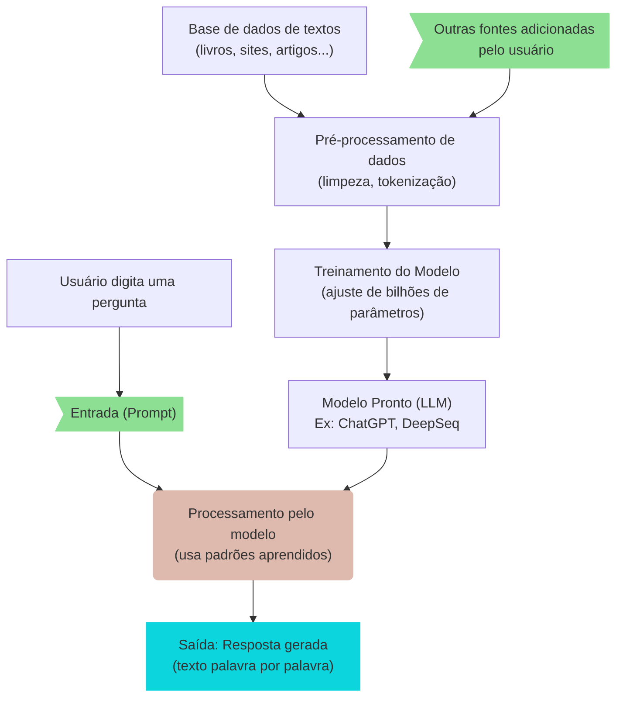
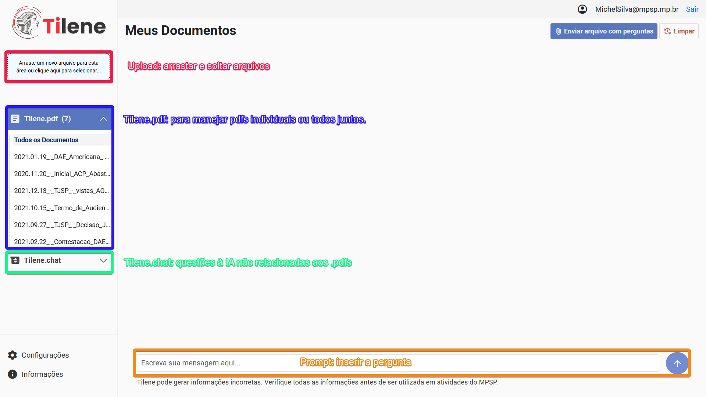

# Aspectos Gerais sobre o Funcionamento

Um modelo de linguagem como o ChatGPT é uma inteligência artificial treinada para entender e gerar texto. Ele funciona em três etapas principais:

1. Treinamento: O modelo "lê" milhões de textos da internet, livros, artigos etc., e aprende padrões de linguagem (como as palavras se combinam, o que vem depois de cada frase etc.).
2. Entrada (_prompt_): Quando você faz uma pergunta ou digita algo, o modelo analisa o que foi escrito.
3. Resposta: Usando o que aprendeu, ele "prediz" qual seria a melhor resposta, palavra por palavra, e gera o texto.

 

 

O Tilene utiliza o GPT-4, com a base de dados atualizada até outubro de 2023, disponibilizado pela _Microsoft_ por meio do _Azure AI Foundry_.

 

---

## Tilene.pdf

Ferramenta para consultar os _.pdf_ (e _.docx_) inseridos pelo usuário. É possível interagir com apenas um dos documentos disponíveis com com `Todos os Documentos`.

 

---

## Tilene.chat

Trata-se de ferramenta similar ao _ChatGPT_ gratuito, porém visto que a utilização ocorre "via API", é previsto que os dados inseridos não serão usadas pelo [Microsoft](https://m365.cloud.microsoft/) e/ou [OpenAI](https://openai.com/).
