# Erros

## Não Resolvidos

### API Version

Alterando a data da versão da API para uma mais moderna (`2024-10-21` ou `2024-12-01-preview`), obtenho erros na aplicação. Isso ocorre pois a data da versão da API impacta diretamente na resposta do arquivo _json_ que vem na chamada da API. Abaixo a resposta da API mais recente.

```json
{
  "choices": [],
  "created": 0,
  "id": "",
  "model": "",
  "object": "",
  "prompt_filter_results": [
    {
      "content_filter_results": {
        "hate": {
          "filtered": false,
          "severity": "safe"
        },
        "self_harm": {
          "filtered": false,
          "severity": "safe"
        },
        "sexual": {
          "filtered": false,
          "severity": "safe"
        },
        "violence": {
          "filtered": false,
          "severity": "safe"
        }
      },
      "prompt_index": 0
    }
  ]
}
Debugging middleware caught exception in streamed response at a point where response headers were already sent.
Traceback (most recent call last):
  File "/home/michel/Codes/GitHub/Org - MPSP-Br/ANIA_TCE_Core/.venv/lib/python3.11/site-packages/werkzeug/wsgi.py", line 256, in __next__
    return self._next()
           ^^^^^^^^^^^^
  File "/home/michel/Codes/GitHub/Org - MPSP-Br/ANIA_TCE_Core/.venv/lib/python3.11/site-packages/werkzeug/wrappers/response.py", line 32, in _iter_encoded
    for item in iterable:
  File "/home/michel/Codes/GitHub/Org - MPSP-Br/ANIA_TCE_Core/.venv/lib/python3.11/site-packages/flask/helpers.py", line 125, in generator
    yield from gen
  File "/mnt/c/Users/michelsilva/Codes/GitHub/Org - MPSP-Br/ANIA_TCE_Core/ania/routes/api.py", line 419, in stream_resposta
    resposta = resposta + text
               ^^^^^^^^^^^^^^^
TypeError: can only concatenate str (not "OpenAIObject") to str
```

<br>

Usando a versão de 2023, temos a seguinte resposta.

```json
Printando Choices
[<OpenAIObject at 0x79c9533b7410> JSON: {
  "delta": {},
  "finish_reason": "stop",
  "index": 0,
  "logprobs": null
}]
{
  "choices": [
    {
      "delta": {},
      "finish_reason": "stop",
      "index": 0,
      "logprobs": null
    }
  ],
  "created": 1750972271,
  "id": "chatcmpl-BmoABGotNNuqCNHiG6jR5msFSoN7V",
  "model": "gpt-4o-2024-11-20",
  "object": "chat.completion.chunk",
  "system_fingerprint": "fp_ee1d74bde0"
}
```

<br>

Seria necessário refatorar toda a aplicação para adapta-la para a nova versão da API, visto que as funções consomem as chaves do arquivo _json_ que é a resposta da API, a qual varia conforme a versão.

???+ note "Nota"

    Importante destacar que por versão da API entende-se que é apenas o conjunto de instruções para que a aplicação solicite informações ao GPT-4. Não está relacionada com a data de atualização do modelo (vist que já estamos usando a última versão) e nem com a data de atualização da base de conhecimento (que é de outubro de 2023, a mais recente atualmente (jun/25)).

<br>

---

## Resolvidos

### Mensagens: _front-end_

A aplicação do TCE parece não ter criado telas de confimações e mensagens.

Ao selecionar um documento para exclusão, aparece uma tela para confirmação (_"Tem certeza que deseja excluir?"_) que não parece ser da aplicação. A tela é "do navegador" (vi isso no Firefox).

Para piorar, caso o usuário selecione a opção _"Não permitir que [url] mostre mensagens assim novamente"_, o usuário perde a possibilidade de excluir futuros documentos, tornando-se necessário limpar o _cache_ (para perder essa configuração) e dai conseguir excluir documentos.

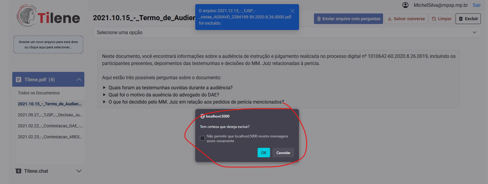

<br>

Isso não se trata de um erro da aplicação. Ela não está dando qualquer _bug_.<br>Trata-se de falta de implantação de uma mensagem no _front-end_ que faça isso.

<br>

O mesmo ocorre para a eventualidade do usuário inserir documento não aceito (que não seja PDF ou DOCX). Caso o usuário clique em _"Não permitir que [url] mostre mensagens assim novamente"_, ele nunca mais verá o alerta e, portanto, não entenderá o por que que a aplicação não está processando o arquivo que ele envia.

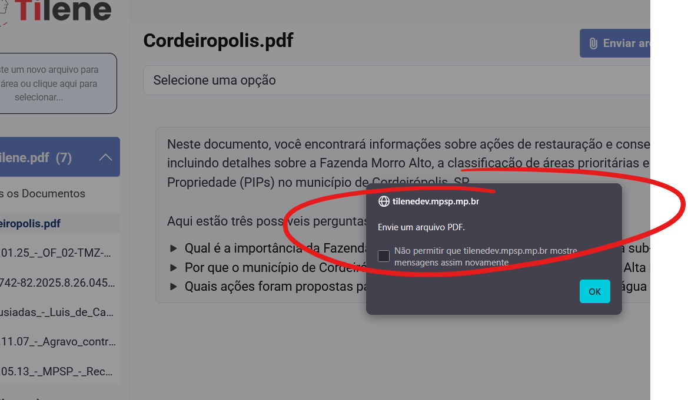

<br>

???+ note "Nota"

    Esse comportamento só foi observado no Firefox (foram testados também o *Chromme* e o *Edge*). É possível remover essa opção no `about:config`, criando uma chave `dom.successive_dialog_time_limit` com valor `0`, conforme sugerido em [Remove "Don't allow" checkbox in firefox prompt](https://support.mozilla.org/en-US/questions/1354891).

<br>

---

### Tamanho máximo do arquivo

A limitação do tamanho do arquivo pode ser configurada em dois locais:

A aplicação _Flask_ (_back-end_) bloqueava uploads de mais de 300 MB (isso é fácil de configurar). Contudo, quando tentava-se subir arquivo com mais de 200 MB aparecia a seguinte mensagem. A mensagem não é informativa e não explica o erro.

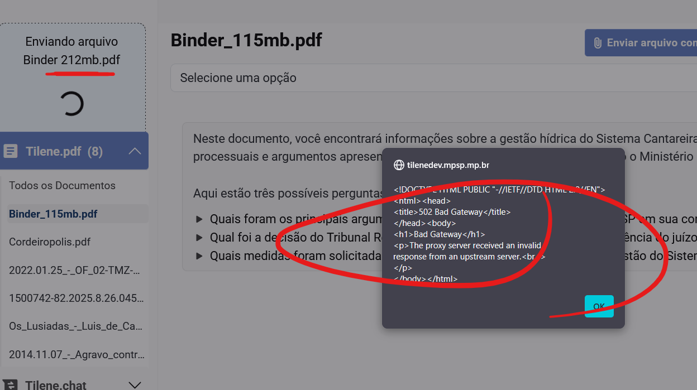

<br>

Descobri que era o _Dropzone.js_ que bloqueava _uploads_ em 256MiB (ou 268 MB), dando a seguinte mensagem:

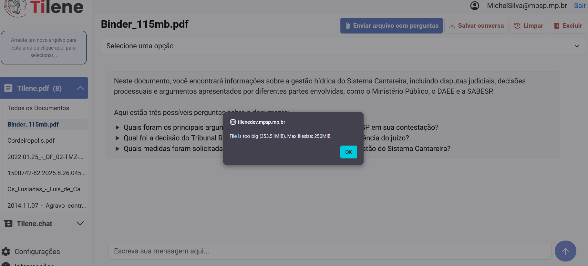

<br>

Como não tenho muito conhecimento em _Vue.js_ para alterar mensagens no _front_, apenas aumentei a limitação do _Dropzone.js_ para 500MB:

```js
Dropzone.options.myDropzone = {
  ...
  maxFilesize: 500,
}
```

<br>

E mantive a limitação do _Flask_ em 300 MB. Tratei o erro incluindo:

```js
error: function (file, message, xhr) {
    this.removeAllFiles(true);
    console.log(message);
    if (xhr && xhr.status == 401) {
        window.location.reload();
    } else if (xhr && xhr.status == 413) {
        alert("Tamanho do arquivo excede o permitido.");
    } else {
        alert(message);
    }
},
```

<br>

Resolvido!

<br>

---

### Favicon

Comentei o código dos favicons e ainda assim tomava erro: `werkzeug.routing.exceptions.BuildError: Could not build url for endpoint 'root.favicon96'. Did you mean 'root.index' instead?`

```html
<!-- Favicon https://flask.palletsprojects.com/en/stable/patterns/favicon/ -->
<!-- <link rel="shortcut icon" href="{{ url_for('static', filename='favicon.ico') }}"> -->
<!-- <link rel="icon" type="image/png" href="{{ url_for('root.favicon96') }}" sizes="96x96" /> -->
<!-- <link rel="icon" type="image/x-icon" href="{{ url_for('root.favicon') }}" /> -->
```

<br>

---

### Servidor Apache

Em 14.05.2025 observei que o servidor Apache instanciado pela _Equipe de Infra_ não expunha a _aplicação_. Estava configurado em ambiente de dev dessa forma:

```shell
<Location />
        Require all granted
        ProxyPass http://localhost:5000/
        SSLRequireSSL On
</Location>
```

<br>

Acresentei o `ProxyPassReverse`, para contornar erros que estava dando.

```shell
<Location />
    Require all granted
    ProxyPass http://localhost:5000/
    ProxyPassReverse http://localhost:5000/
    SSLRequireSSL On
</Location>
```

<br>

---

### Data do Modelo

Algumas reclamação surgiram pois o modelo parecia estar desatualizado. A título de exemplo, quando perguntava-se ao _chat_ "Quem é o presidente dos EUA", ele respondia que era o Joe Biden, quando o Thump já estava com seu mandato vigente.

Em reunião com a _Equide de Infra_ em 25.06.2025, foi apresentada imagem que evidencia que o modelo que está sendo utilizado pelo Tilene atualmente, está atualizado até outubro de 2023. Trata-se do melhor que temos disponível.

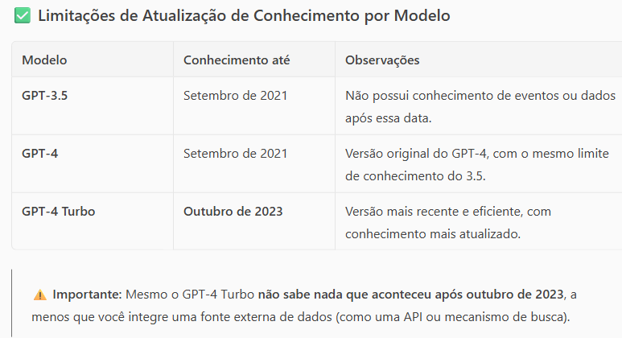

<br>

Especialistas da _Microsoft_ informaram à _Equide de Infra_ que enquanto modelos treinados com dados mais recentes não são lançados, é possível "mante-los atualizados" usando algumas das estrtégias a seguir:

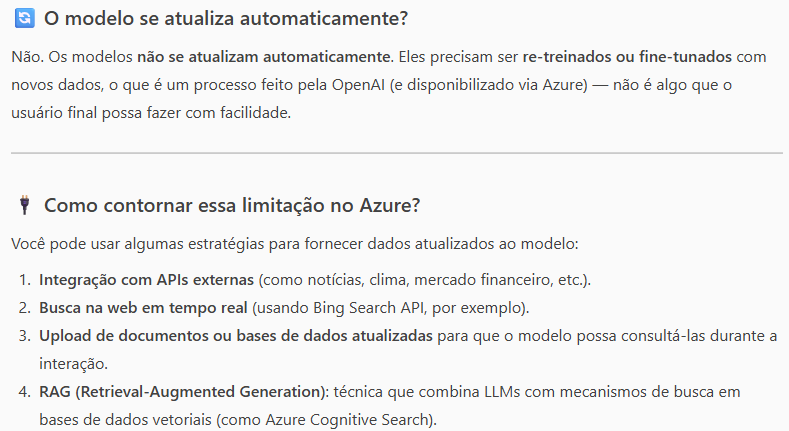

<br>

Em 25.06.2025 fiz a pergunta "Você está atualizado até qual data?" para o [Copilot/Microsoft](https://m365.cloud.microsoft/chat/?auth=2&home=1), a resposta é a mesma: outubro de 2023:

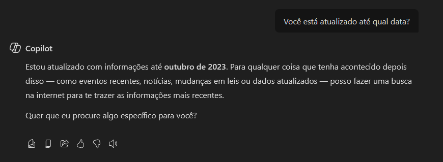

<br>

Além disso, havia uma confusão sobre "o que é a data de versão do modelo", visto que eu confundia os conceitos.

Quando eu atualizava a data nas variáveis de ambiente, com a data da versão do modelo, tomava erro:

```shell
Message: 'Erro - OpenAI back:'
Arguments: (InvalidRequestError(message='Resource not found', param=None, code='404', http_status=404, request_id=None),)
```

<br>

Para esclarecer, existem diferentes datas que podem ser confundidas.

1. Data de "Conhecimento Até", que reflete qual a data da base de dados que treinou o modelo instanciado/utilizado. O modelo usado é out/2023 (ou 2023-10). Isso não se relacionam em nada com as configurações das datas da API.
2. Versão do modelo: no [Azure AI Foundry](https://ai.azure.com/) é possível ver qual é a "versão do modelo" ao implanta-los. O modelo que o Tilene usa tem "versão do modelo: 2024-11-20". E eu achava que isso é a variável que devia ser inserido no parâmetro `api_version`.
3. O conceito de _API Version_ é uma data que não é apresentada no [Azure AI Foundry](https://ai.azure.com/), o que é (no meu entendimento) bizarro!! Lendo _posts_ ([Azure OpenAI, Unable to use deployed model version](https://stackoverflow.com/questions/79124624/azure-openai-unable-to-use-deployed-model-version/79232702#79232702)), encontrei que a solução está na definição da `OPENAI_API_VERSION` com a data que consta no [Azure OpenAI in Azure AI Foundry Models REST API reference](https://learn.microsoft.com/en-us/azure/ai-services/openai/reference). Em 26.06.2025 essa data era `2024-10-21`, que destoa da "versão do modelo: 2024-11-20". Já o exemplo que consta no [Azure AI Foundry](https://ai.azure.com/) mostra a que a `API VERSION` é `2024-12-01-preview` e funciona!

```python
import os
from openai import AzureOpenAI

client = AzureOpenAI(
    api_version="2024-12-01-preview",
    endpoint="https://openai-ania.openai.azure.com/",
    credential=AzureKeyCredential("<API_KEY>")
)
```

<br>

O comentário no _post_ [Why I'm getting 404 Resource Not Found to my newly Azure OpenAI deployment?](https://stackoverflow.com/questions/75172116/why-im-getting-404-resource-not-found-to-my-newly-azure-openai-deployment#comment139415812_76058424) esclareceu a dúvida.

> AOAI docs have a vernacular issue. When you deploy a model to AOIA, there is a "version". Sometimes this "version" overlaps with the api_version. There is a "version" listed in the docs that overlap with this version. Prime example is 2024-08-06. Lets stick to api_version and model_version. Lets go a step further and make one a date, the other an int. Confusion eliminated.
>
> > A documentação da AOAI tem um problema vernacular. Quando você implanta um modelo na AOIA, há uma "versão". Às vezes, essa "versão" se sobrepõe à api_version. Há uma "versão" listada na documentação que se sobrepõe a esta versão. O melhor exemplo é 2024-08-06. Vamos nos ater à api_version e à model_version. Vamos dar um passo adiante e definir uma como data e a outra como int. Confusão eliminada.

<br>

---

### Conteúdo Sensível

Em 23.05.2025 o Dr. Tulio Vinicius Rosa reportou que a aplicação interrompe abruptamente a análise sem prosseguir no cumprimento do _prompt_.


<br>

Em 25.06.2025, durante reunião com _Equipe de Infra_, fui informado que foi realizado ajuste da API em 16.06.2025, deixando os filtros de conteúdos sensíveis no "mínimo". Ver mais no post [Filtragem de conteúdo no portal do Azure AI Foundry](https://learn.microsoft.com/pt-br/azure/ai-foundry/concepts/content-filtering).

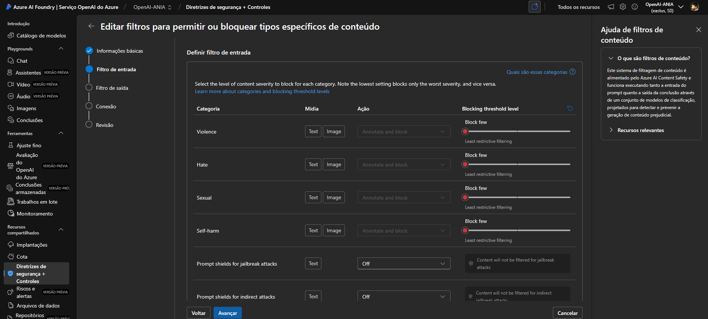

<br>

_TODO_: Observar se os usuários estão ainda com problemas nos filtros.

<br>

---

### SSL e _Firewall_

Em 12.05.2025 passei a tomar erro no servidor de aplicação de homologação, ao tentar instanciar a aplicação.

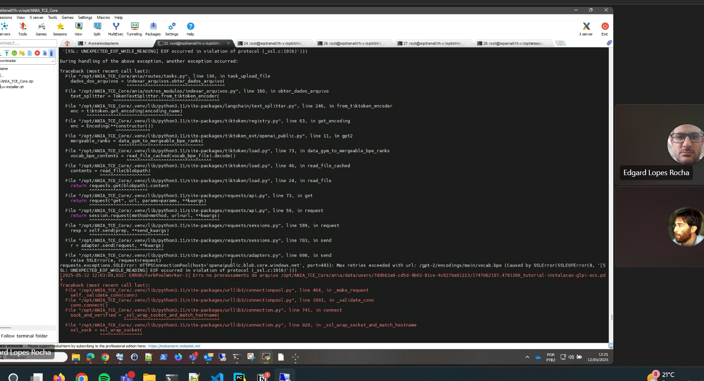

<br>

Aparecia também um _pop-up_ com erro na interface _web_.

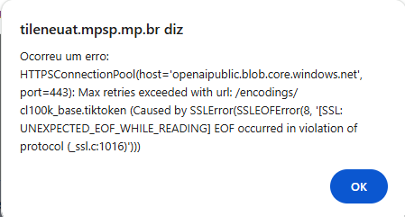

<br>

Lendo o _post_ [NewConnectionError keeps coming up over a .tiktoken file](https://community.openai.com/t/newconnectionerror-keeps-coming-up-over-a-tiktoken-file/670052) observei que o [tiktoken](https://github.com/openai/tiktoken) tenta ler a _url_ abaixo para criar um dicionário e o firewall do MP barrava o _site_.

Após contatar Equipe de segurança e solicitar regra no firewall para permitir domínio `windows.net`, o problema foi resolvido.

```shell
# URL https://openaipublic.blob.core.windows.net

# Para testes
curl -v https://openaipublic.blob.core.windows.net/encodings/cl100k_base.tiktoken
```

<br>

---

### Internal Server Error

Em 06.06.2025 tomei o erro abaixo ao acessar a aplicação. Observei que após alguns _refreshs_ no navegador o problema some. É como se a aplicação não estivesse conectada ao _db_, ou levasse algum tempo para conectar.

```shell
Internal Server Error
The server encountered an internal error and was unable to complete your request. Either the server is overloaded or there is an error in the application.
```

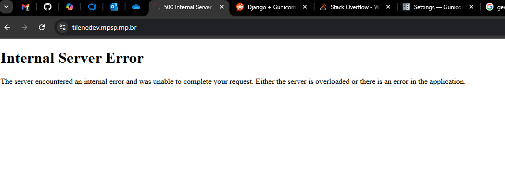

<br>

Analisando o _log_ `cat /opt/tilene/ANIA_TCE_Core/gunicorn_error.log` encontrei o erro:

> [2025-06-05 16:15:40 -0300] [3602237] [CRITICAL] WORKER TIMEOUT (pid:3602285)
> [2025-06-05 16:15:41 -0300] [3602237] [ERROR] Worker (pid:3602285) was sent SIGKILL! Perhaps out of memory?

<br>

Solicitei à Equipe de Infra que aumentasse a RAM (de 4GB para 8GB), em ambiente de desenvolvimento. Ainda assim o problema era observado.

Dias depois ajustei outro problema e esse erro foi resolvido com [esse ajuste](#db_psycopg2operationalerror_server_closed_the_connection_unexpectedly).

<br>

---

### Proxy Error

Acho que tem erro no Apache.

```shell
Proxy Error
The proxy server received an invalid response from an upstream server.
The proxy server could not handle the request
Reason: Error reading from remote server
```

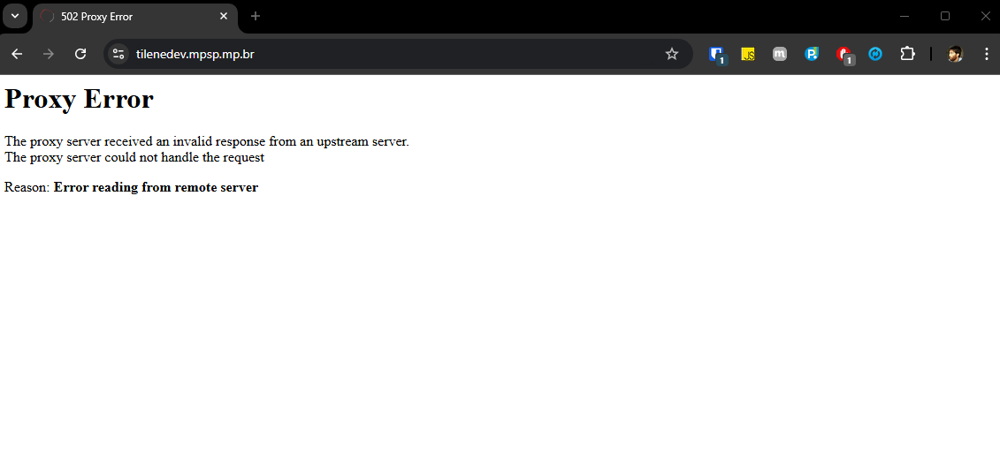

<br>

Mais um erro resolvido com [esse ajuste](#db_psycopg2operationalerror_server_closed_the_connection_unexpectedly).

<br>

---

### DB: psycopg2.errors

Ao tentar o _upload_, dá erro....

```shell
Não foi possível processar o arquivo LT_0066-17_MAHUAC_GAEMA_PIRACICABA_ACP_1752-08.pdf. <class 'sqlalchemy.exc.IntegrityError'
(
['(psycopg2.errors.ForeignKeyViolation) insert or update on table "log_uso_api" violates foreign key constraint "fk_id_usuario"\nDETAIL: Key (id_usuario)=(0) is not present in table "usuarios".\n']
)
```

```shell
Não foi possível processar o arquivo duas_paginas.pdf.
<class 'sqlalchemy.exc.ProgrammingError'>(['(psycopg2.errors.UndefinedFunction) operator does not exist:
uuid = integer\nLINE 1: DELETE FROM textos WHERE textos.id_usuario = 1 AND textos.ar...\n
^\nHINT: No operator matches the given name and argument types. You might need to add explicit type casts.\n'])
```

<br>

Tratava-se de erro das pemissões do usuário do _db_. Ajustado.

<br>

---

### DB: psycopg2.OperationalError: server closed the connection unexpectedly

Ao entrar na função do `login_usuário`, após algum tempo sem interagir com a aplicação, recebo o erro.

```shell
Traceback (most recent call last):
File "/opt/tilene/ANIA_TCE_Core/.venv/lib/python3.11/site-packages/sqlalchemy/engine/base.py", line 1963, in \_exec_single_context
self.dialect.do_execute(
File "/opt/tilene/ANIA_TCE_Core/.venv/lib/python3.11/site-packages/sqlalchemy/engine/default.py", line 943, in do_execute
cursor.execute(statement, parameters)
psycopg2.OperationalError: server closed the connection unexpectedly
This probably means the server terminated abnormally
before or while processing the request.
```

<br>

O erro é similar ao reportado por Alessandra em 19.05.2025.
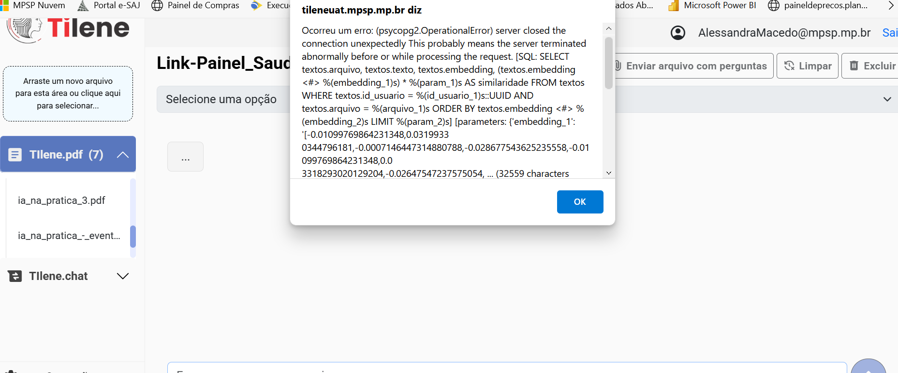

<br>

Possíveis soluções:

- [middleware caught exception in streamed response flask app](https://stackoverflow.com/questions/62866945/middleware-caught-exception-in-streamed-response-flask-app)
- [how to fix "OperationalError: (psycopg2.OperationalError) server closed the connection unexpectedly"](https://stackoverflow.com/questions/55457069/how-to-fix-operationalerror-psycopg2-operationalerror-server-closed-the-conn)

<br>

Sugestão para resolução: adicione estas configurações na sua config do _Flask_... e, deu certo! Resolvido!

```python
# ...existing code...
SQLALCHEMY_ENGINE_OPTIONS = {
    "pool_pre_ping": True,      # Testa a conexão antes de usar
    "pool_recycle": 1800,       # Recicla conexões a cada 30 minutos (em segundos)
}
# ...existing code...
```
