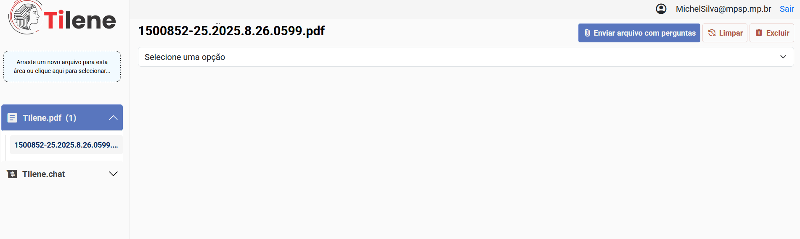
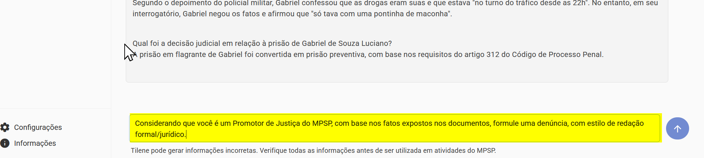
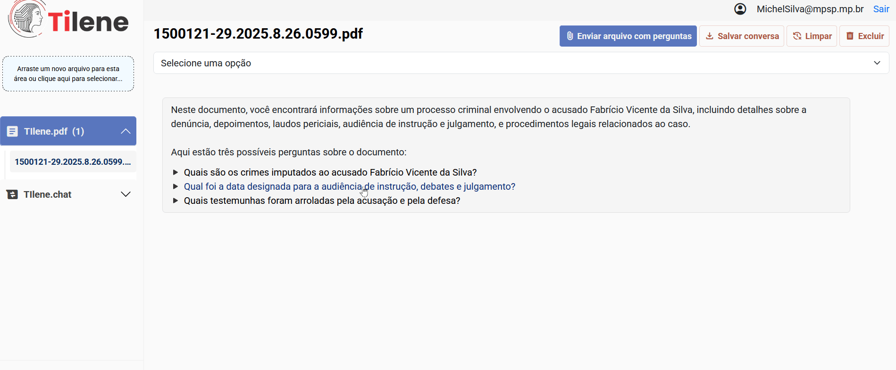

# _Prompts_

Um _prompt_, no contexto de inteligência artificial, é uma instrução, pergunta ou comando enviado pelo usuário para guiar a resposta de um modelo de linguagem, como ChatGPT ou Gemini. Ele funciona como um gatilho que define o contexto, o tom e a direção da saída gerada pela IA, influenciando diretamente a qualidade e a relevância do resultado. _Prompts_ podem variar desde solicitações simples (_"Explique o teorema de Pitágoras"_) até estruturas complexas com exemplos, formatações específicas ou condicionais (_"Escreva um e-mail formal em espanhol solicitando um orçamento para 100 unidades de um produto"_).

!!! note "Nota"

    A clareza e a especificidade do _prompt_ são cruciais: quanto mais preciso for o _input_, mais útil e direcionada será a resposta da IA. O _prompt_ é a interface de comunicação entre o usuário e a inteligência artificial, transformando intenções humanas em respostas algorítmicas eficazes.

 

O Tilene dispõe de três maneiras distintas de inserir _prompts_:

 

---

## _Prompts_ Pré-Configurados

O acesso aos "_prompts_ pré-configurados" se dá na interface da aplicação, no menu _dropdown_, onde basta selecionara opção desejada. Para cada opção, será disparado um _prompt_ na área do _chat_ com o conteúdo respectivo.

 

Abaixo são apresentados os _prompts_ pré configurados, sendo apresentado o "Nome do _Prompt_" e o respectivo conteúdo que é questionado à Inteligência Artificial.

|   # | Nome do _Prompt_         | _Prompt_                                                                                                                                                                                                                                                                   |
| --: | :----------------------- | :------------------------------------------------------------------------------------------------------------------------------------------------------------------------------------------------------------------------------------------------------------------------- |
|   1 | Apresentação e perguntas | Escreva uma frase simples sobre o que encontrarei no documento ('Neste documento, você encontrará informações...') e, em um novo parágrafo, faça uma lista numerada de 3 possíveis perguntas ('Aqui estão três possíveis perguntas sobre...'), uma pergunta em cada linha. |
|   2 | Resumo                   | Analise o conteúdo e faça um resumo.                                                                                                                                                                                                                                       |
|   3 | Outline                  | Transforme o conteúdo em outline.                                                                                                                                                                                                                                          |
|   4 | Perguntas e Respostas    | Elabore 3 perguntas e respostas sobre o conteúdo. Coloque a pergunta em uma linha e a resposta na linha seguinte. Não inclua prefixo.                                                                                                                                      |
|   5 | Palavras-chave           | Analise o conteúdo e liste cinco palavras-chave.                                                                                                                                                                                                                           |
|   6 | Tags                     | Elabore tags para o texto.                                                                                                                                                                                                                                                 |
|   7 | Tipo de documento        | Analise os documentos recebidos e informe qual é o tipo de documento que foi recebido. Algumas opções são: petição inicial, denúncia penal, parecer técnico, acórdão, sentença, estudo de impacto ambiental (EIA).                                                         |
|   8 | Análise jurídica         | Faça uma análise jurídica do documento resumindo os fatos jurídicos e apontando as normas relacionadas a cada fato jurídico. Ao resumir os fatos, indique expresamente em parênteses (por exemplo: '(p. 3)') as páginas do documento em que cada informação aparece        |

 

---

## _Prompts_ "Livre"

Os _prompts_ "livre" é aquele que o você tem a liberdade de formular a questão a ser enviada para a IA da maneira como entender. É ideal para trazer mais contexto para a pergunta, informando, por exemplo:

- Qual o estilo de redação desejado (_"formule resposta com redação em estilo jurídico..."_)
- Qual a função que você deseja que a IA interprete (_"Considernado que você é um Promotor de Justiça do Ministério Público do Estado de São Paulo e precise fazer uma denúncia..."_)

 

---

## _Prompts_ Pós-_Uploads_

Os _prompts_ pós-_uploads_ são aquelas questões que aparecem como sugestão logo após o primeiro _upload_ de um documento.

