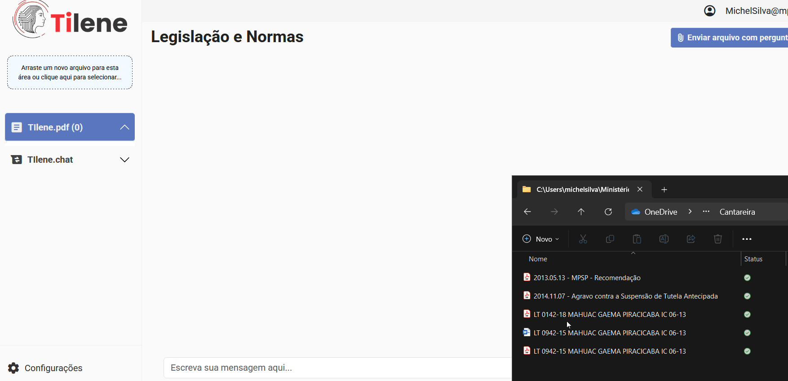
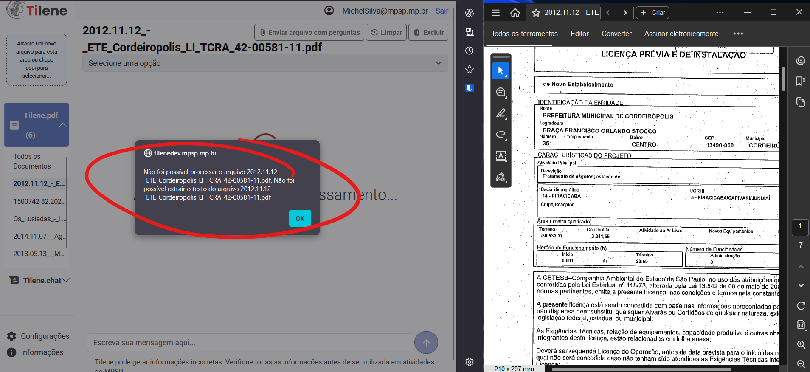
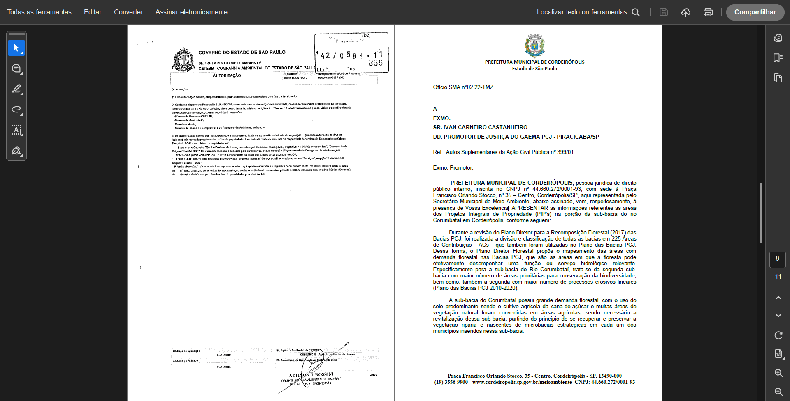

# _Upload_ de Documentos

O _upload_ de documentos funciona de modo bastante simples, utilizando _drag and drop_ (arrastar e soltar).

!!! note "Nota"

    É possível também clicar sobre a área demarcada para o _drag and drop_ e abrirá a opção para navegar até uma pasta e selecionar o arquivo.

 

 

O usuário pode interagir com os documentos de maneira isolada, ao seleciona-los individualmente, ou ainda pode selecionar `Todos os Documentos` para interagir com eles em conjunto.

!!! tip "Recomendação"

    Recomenda-se a utilização da ferramenta realizando o _upload_ documentos apartados, ao invés de fazer o _upload_ de um processo inteiro. Essa recomendação é especialmente importante ao se utilizar a [configuração](configurações.md) `Exibir referências utilizadas na elaboração da resposta`.

 

Algumas informações importantes:

- Os arquivos suportados são: _.pdf_ e _.docx_
- É possível fazer o _upload_ de mais de um arquivo de maneira simultânea

 

---

## Limitações Conhecidas

### _PDFs_ sem _OCR_

A aplicação só consegue ler PDFs que contenham texto digital. Isso inclui arquivos nato-digitais (gerados por editores de texto) ou PDFs com _OCR_ (_Optical Character Recognition_). PDFs que são apenas imagens escaneadas, sem _OCR_, não serão lidos corretamente.

Documentos escaneados usualmente precisam passar pela etapa de _OCR_ para que o texto seja possível de ser selecionado e, portanto, lido pelas inteligências artificiais.

- Sem _OCR_: o PDF é como uma "foto" de uma página.
- Com _OCR_: o PDF continua parecendo uma imagem, mas há uma camada de texto invisível por trás da imagem, que pode ser acessada digitalmente.

 

Caso seja feito o _upload_ de documentos escaneados, sem _OCR_, a aplicação indicará que _"Não é possível processar o arquivo..."_.

 

???+ example "Exemplo"

    Caso seja feito o *upload* de um PDF contendo parte dos documentos com OCR (ou nato-digitais) e parte dos documentos sem *OCR*, o **Tilene** apenas processará o texto disponível.

    No exemplo abaixo tem um arquivo PDF de um processo, com parte (a esquerda) sem *OCR* e a folha da direita com *OCR*. Nesse exemplo, apenas a página com *OCR* será processada pelo Tilene.

    

 

---

### Tamanho do Arquivo

O tamanho máximo para _upload_ dos arquivos é de 300 MB. Lembrando que é possível realizar o _upload_ de mais de um arquivo.
